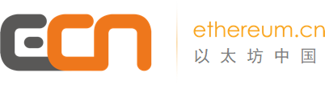

# 以太坊开发者门户

#### \*\*\*\*

## \*\*\*\*😉 **欢迎来到ECN以太坊中国！**

ECN \(Ethereum Community Network/ethereum.cn\) 是一个非营利性的中国以太坊社区，致力于为以太坊中文开发者、爱好者提供全方位的教育支持和优质的前沿资讯，为中国社区成员创建线上线下观点交流和价值传递的载体，旨在助力以太坊全球生态发展。

### 🤔 ethereum.cn 以太坊元知识计划 \(EthKnowledge\) 可以为开发者提供什么？

**1. 以太坊开发入门技术文档；**

**2. 全面的以太坊开发工具；**

**3. 以太坊开发标准和规范。**

为了中国区块链开发社区的发展，我们搜寻了海内外的以太坊开发资源，翻译成中文并共享给大家，希望有志者可以“链”成武林高手，叱诧风云！

目前以太坊开源资源众多，并不断在发展中，我们希望可以及时更新，为大家提供最新的武器。

## 我们的愿景

创造更美好的未来！

## _郑重提示：_

_**我们是非官方，起名为“以太坊中国”仅为了较高的辨识度和我们网站域名ethereum.cn相关, 但我们不代表官方； 即使“官方”字眼对以太坊社区并没有什么意义。**_

_**ECN里面的内容并不完善，我们还在努力中，并且以太坊基金会开发团队的更新也逐渐频繁，最新资料请及时访问我们。**_

