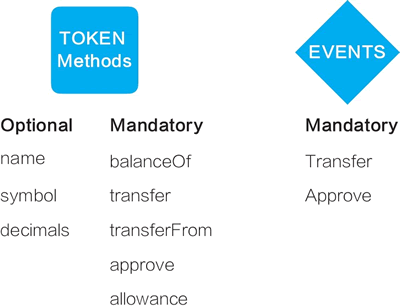

# ERC20



要定义一种ERC20通证你需要：

* 合约地址
* 通证供应数量

还包括一些表示额外信息的可选项：

* 通证名字
* 通证标志
* 小数，或可以对通证进行何种程度的分割（小数点后0-18位）

ERC20还定义了两种事件类型：`Transfer()`, 在转移通证时触发；`Approve()`，每次成功调用`approve()`方式时触发。通证可能还包括`allowance()`, `approve()`, 和`transferFrom()`等高级功能。

### Method

**name**

```text
function name() constant returns (string name) 
```

返回string类型的ERC20代币的名字

**symbol**

```text
function symbol() constant returns (string symbol)
```

返回string类型的ERC20代币的符号，即代币简称

**decimals**

```text
function decimals() constant returns (uint8 decimals)
```

通证可分割到小数点后几位

**totalSupply**

```text
function totalSupply() constant returns (uint256 totalSupply)
```

发行代币的总量，可以通过这个函数来获取。所有智能合约发行的代币总量是一定的，totalSupply必须设置初始值

**balanceOf**

```text
function balanceOf(address _owner) constant returns (uint256 balance)
```

输入地址，可以获取该地址代币的余额

**transfer**

```text
function transfer(address _to, uint256 _value) returns (bool success)
```

调用transfer函数将自己的token转账给\_to地址，\_value为转账数量

**approve**

```text
function approve(address _spender, uint256 _value) returns (bool success)
```

批准\_spender账户从自己的账户转移\_value个token，可以分多次转移

**transferFrom**

```text
function transferFrom(address _from, address _to, uint256 _value) returns (bool success)
```

与approve搭配使用，approve批准之后，调用transferFrom函数来转移token

**allowance**

```text
function allowance(address _owner, address _spender) constant returns (uint256 remaining)
```

返回\_spender还能提取token的个数

### Events

**Transfer**

```text
event Transfer(address indexed _from, address indexed _to, uint256 _value)
```

当成功转移通证时，一定要触发Transfer事件

**Approval**

```text
event Approval(address indexed _owner, address indexed _spender, uint256 _value)
```

当成功调用approval函数时，一定要触发Approval事件  


  


