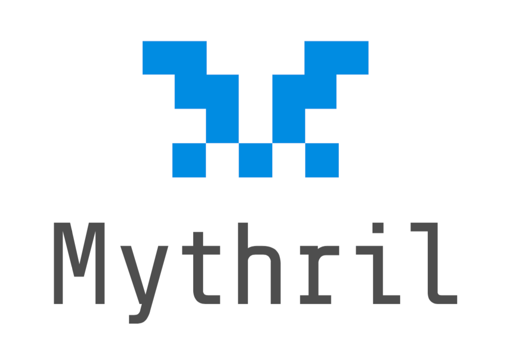

# Mythril

**Mythril**是开源EVM字节码安全性分析工具，用于检测兼容EVM区块链的智能合约漏洞。

#### Github

* [https://github.com/b-mueller/awesome-mythx-smart-contract-security-tools](https://github.com/b-mueller/awesome-mythx-smart-contract-security-tools)

